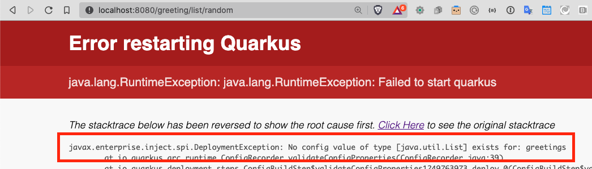

== Quarkus Configuration

This section covers externalizing configuration using MicroProfile.
In these instructions, configuration parameters are stored in
`application.properties` instead of `microprofile-config.properties`.

NOTE: While Quarkus supports MicroProfile APIs, it also supports much more
than MicroProfile like Spring APIs and Vert.x APIs.
For that reason, https://quarkus.io/guides/[the Quarkus guides] refer to the
more framework-agnostic `src/main/resources/application.properties`.

Change the hard coded value to return a random value.

. Create greetings property in `application.properties`
+
--
.application.properties
[source,properties]
----
greetings=Howdy from app.prop,Hola from app.prop,Hello from app.prop
----
--
+
// *********************************************
'''
. Use MicroProfile Config to inject greetings
+
--
.GreetingResource.java
[source,java]
----
@ConfigProperty(name="greetings")             // <1>
List<String> greetings = new ArrayList<>();
----
<1> Inject the list of greetings from application.proprties into the greetings list
--
+
// *********************************************
'''

. Test the `/list` endpoint
+
--
.Terminal 2
[source,shell script]
----
curl -i http://localhost:8080/greeting/list
----

.Terminal 2 Output
----
HTTP/1.1 200 OK
Content-Length: 66
Content-Type: application/json

["Howdy from app.prop","Hola from app.prop","Hello from app.prop"]
----
--
+
// *********************************************
'''

. Next, let's get a random greeting from the list.
The primary intent is to create a second method that will be used in future sections.
+
.GreetingResource.java
+
--
[source,java]
----
@GET
@Path("/list/random")
@Produces(MediaType.TEXT_PLAIN)
public String randomGreeting() {
    Random r = new Random();
    return greetings.get(r.nextInt(listGreetings().size())); // <1>
}
----
<1> Return a random greeting
--
+
// *********************************************
'''

. Test the `/list/random` endpoint.
Run multiple times to see random output.
+
--
.Terminal 2
[source,shell script]
----
curl -i http://localhost:8080/greeting/list/random
----

.Terminal 2 Output
----
HTTP/1.1 200 OK
Content-Length: 19
Content-Type: text/plain;charset=UTF-8

Hello from app.prop
----
--
+
// *********************************************
'''

. Comment out the greeting property in `application.properties`
+
--
.application.propertiese
[source,properties]
----
#greetings=Howdy from app.prop,Hola from app.prop,Hello from app.prop
----

Load URL in browser to better see how Quarkus reverses the stack trace to put the primary error at the top of the browsr page:

// *********************************************
'''
--
+
. Uncomment the `greeting` property in `application.properties` that was commented out in the prior step and refresh the browser
+
// *********************************************
'''

. Override the greetings value in the property file with a
`GREETINGS` environment variable.
Press CTRL-C, set the `GREETINGS` environment variable, and restart the application.
+
--
.Terminal 1
----
CTRL-C # <1>
export GREETINGS="Howdy from env,Hola from env,Hello from env" # <2>
mvn quarkus:dev # <3>
----
<1> Stop the application run with `mvn quarkus:dev`
<2> Override the `greeting` property with an environment variable
<3> Restart the application in developer mode

[source,shell script]
.Terminal 2 (Test the application)
----
curl -i http://localhost:8080/greeting/list
----

.Terminal 2 Output
[source,text]
----
HTTP/1.1 200 OK
Content-Length: 51
Content-Type: application/json

["Howdy from env","Hola from env","Hello from env"]
----
--
+
// *********************************************
'''

. Override the `GREETINGS` environment value in the property file with a system property
+
--
.Terminal 1
[source,shell script]
----
CTRL-C  # <1>
mvn quarkus:dev -Dgreetings="Howdy from system,Hola from system,Hello from system" # <2>
----
<1> Stop application
<2> Start application with system property defined
--
+
// *********************************************
'''

. Remove the environment variable and restart the application
+
--
.Terminal 1
[source,shell script]
----
CTRL-C
unset GREETINGS # <1>
mvn quarkus:dev # <2>
----
<1> Remove the `GREETINGS` environment variable
<2> Restart the application *without* the greetings system property defined
--
+
// *********************************************
'''

. Read a configuraton into a configuration property objects.
This is useful for consolidating related configuration propertise into a single class.
+
--
.UnusedConfigProperties.java
----
@ConfigProperties(prefix = "unused")                    // <1>
public class UnusedConfigProperties {
    int number;                                         // <2>

    String string="Unused string";                      // <2>

    Optional<Boolean> flag;                             // <3>

    public int getNumber() {
        return number;
    }

    public void setNumber(int number) {
        this.number = number;
    }

    public String getString() {
        return string;
    }

    public void setString(String string) {
        this.string = string;
    }

    public boolean getFlag() {
        return flag.isEmpty() ? false : flag.get();
    }

    public void setFlag(Optional<Boolean> flag) {
        this.flag = flag;
    }
}

----
<1> `@ConfigurationProperties` object will auto-inject property values
in fields.
The `prefix` specifies that the properties are prefixed with `unused.`.
<2> Field injection is supported.
The property names will be `unused.number` and `unused.string`.
If no property value is defined, and no default value is supplieed, a
DeploymentException will be thrown.
These two fields avoid a DeploymentException when no property value is defined
by providing a default field values.
<3> Optional fields are supported.
--
+
NOTE: https://download.eclipse.org/microprofile/microprofile-config-2.0-RC1/microprofile-config-spec.html[MicroProfile Config 2.0],
planning a release in Q4 2020 as a part of MicroProfile 4.0,
link:https://download.eclipse.org/microprofile/microprofile-config-2.0-RC1/microprofile-config-spec.html#_aggregate_related_properties_into_a_cdi_bean[will formally define ConfigProperties]
where class member fields can be be annotated
with `@ConfigProperty`.
Quarkus plans to support _MicroProfile 4.0_ and _MicroProfile Config 2.0_.
+
// *********************************************
'''

. Update GreetingResource.java with an endpont to return the values of UnusedConfigProperties.
+
--
.GreetingResource.java
[source,java]
----
UnusedConfigProperties unused;

public GreetingResource(UnusedConfigProperties unused) {  // <1>
    this.unused = unused;
}

@GET
@Path("/unused")
@Produces(MediaType.APPLICATION_JSON)
public UnusedConfigProperties getProps() {                // <2>
    return unused;
}
----
<1> Inject `UnusedConfigProperties` instance into `unused` field.
This approach uses constructor injection.
Field injection using `@Inject` is also supported.
<2> A simple endpont that returns `unused` in JSON format.
--
+
// *********************************************
'''

. Update `application.properties` with `unused.*` properties

+
--
.application.properties
[source,properties]
----
# Demonstrate @ConfigurationProperties feature, but are not used in application

unused.flag=true
unused.number=10
unused.string=Unused string
----
--
+
// *********************************************
'''

. Test `UnusedProperties` using the REST endpoint
+
--
.Terminal 2
[source,shell script]
----
curl -i http://localhost:8080/greeting/unused
----

.Terminal 2 output
[source,text]
----
HTTP/1.1 200 OK
Content-Length: 50
Content-Type: application/json

{"flag":false,"number":0,"string":"Unused string"}
----
--
+
// *********************************************
'''

. Test for updated `unused` property values

+
--
.Terminal 2
[source,bash]
----
curl -i http://localhost:8080/greeting/unused
----

.Terminal 2 output
[source,text]
----
HTTP/1.1 200 OK
Content-Length: 50
Content-Type: application/json

{"flag":true,"number":10,"string":"Unused string"}
----
--
