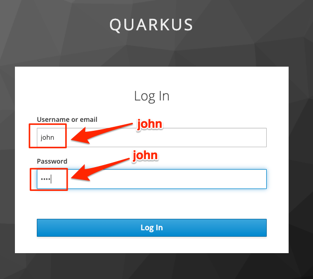

== Quarkus Security

This section covers HTTP Basic authentication with authentication using
property files, OpenID Connect, and Bearer tokens

. Add necessary extensions
+
--
.Terminal 3
[source,shell script]
----
 mvn quarkus:add-extension -Dextensions=security-properties-file  # <1>
----
<1> The extension is really quarkus-elytron-security-properties-file,
but add-extension will attempt to add an extension based on a unique string

.Terminal 3 output
[source,text]
----
...

✅ Extension io.quarkus:quarkus-elytron-security-properties-file has been installed

[INFO] ------------------------------------------------------------------------
[INFO] BUILD SUCCESS

...
----
--
+
// *********************************************
'''

. Enable basic authentication and provide credentials in application.properties
+
--
.application.properties
[source,properties]
----
# Property file security realm

quarkus.http.auth.basic=true                            # <1>
quarkus.security.users.embedded.enabled=true            # <2>
quarkus.security.users.embedded.plain-text=true         # <3>
quarkus.security.users.embedded.users.john=john         # <4>
quarkus.security.users.embedded.users.jane=jane         # <5>
quarkus.security.users.embedded.roles.john=admin,user   # <6>
quarkus.security.users.embedded.roles.jane=user         # <7>
----
<1> Enable http basic authentication
<2> Enable file-based user credentials
<3> Passwords are in plain text (vs MD5 hash, for example)
<4> Define user john
<5> Define user jane
<6> Define john's roles
<7> Define jane's roles
--
+
// *********************************************
'''

. Protect the `/training` endpoint (only the top-level path)
+
--
.TrainingResource.java
[source,java]
----
@GET
@Produces(MediaType.APPLICATION_JSON)
@RolesAllowed("admin")                      // <1>
public List<Training> listTrainings() {
    return Training.listAll();
}
----
<1> Only users in the _admin_ role can access this resource
--
+
// *********************************************
'''

. Test the endpoint with a user in _admin_ role
+
--
.Terminal 3
[source,shell script]
----
curl -i --user john:john localhost:8088/training      # <1>
----
<1> `--user john:john` is the format for "user:password"

.Terminal 3 output
[source,json]
----
HTTP/1.1 200 OK
Content-Length: 223
Content-Type: application/json

[{"id":1,"name":"Quarkus First Steps!","students":[{"id":3,"name":"John Doe"},
{"id":4,"name":"Jane Doe"}]}, {"id":2,"name":"Quarkus and MicroProfile!",
"students":[{"id":5,"name":"John Duke"},{"id":6,"name":"Jane Quarkus"}]}]
----
--
+
// *********************************************
'''

. Test endpoint with insufficient privileges
+
--
.Terminal 3
[source,shell script]
----
curl -i --user jane:jane localhost:8088/training
----

.Terminal 3 output
[source,text]
----
HTTP/1.1 403 Forbidden
Content-Length: 0
----
--
+
// *********************************************
'''

. Add test-security extension to improve security test experience
+
--
.pom.xml
[source,java]
----
<dependency>
  <groupId>io.quarkus</groupId>
  <artifactId>quarkus-test-security</artifactId>
  <scope>test</scope>
</dependency>
----
--
+
// *********************************************
'''

. Create a test that provides credentials when running test on protected resource
+
--
.Create file TestSecurity.java
[source,java]
----
@QuarkusTest
@TestSecurity(user="john", roles= {"admin", "user"})                  // <1>
//@TestSecurity(authorizationEnabled = false)                         // <2>
@TestHTTPEndpoint(TrainingResource.class)
public class SecurityTest {
    @Test
    void testTraining() {
        given()
                .when().get()
                .then()
                .statusCode(200)
                .body("[1].name", is("Quarkus and MicroProfile!"))    // <3>
                .body("[1].students[1].id", is(6))                    // <4>
                .body("[1].students[1].name", is("Jane Quarkus"));    // <5>
    }
}
----
<1> Use `@TestSecurity` annotation to define credentials the tests are run with
<2> Alternatively, disable authorization entirely.
Feel free to try it and comment out the other `@TestSecurity` annotation
<3> This shows RestAssured using a JSONPath expression to validate the training name
<4> This shows RestAssured using a JSONPath expression to validate the student id
<5> This shows RestAssured using a JSONPath expression to validate the student name
--
+
// *********************************************
'''

. Test @TestSecurity annotation
+
--
.Terminal 3
[source,shell script]
----
mvn test
----

.Terminal 3 output
[source,text]
----
...

[INFO] Tests run: 6, Failures: 0, Errors: 0, Skipped: 0
[INFO]
[INFO] ------------------------------------------------------------------------
[INFO] BUILD SUCCESS

...
----
--
+
// *********************************************
'''

. Install Keycloak for authentication and autorization
+
--
.Terminal 3
[source,shell script]
----
# From the top-level project directory
docker/start-keycloak.sh
----

.Terminal 3 output
[source,text]
----
8682008f6df33ff3a78fefb307cf02f3ae47ca9fe1b001c5b78b4e529dbeebee  <1>
----
<1> Container ID will change each time a container is created
--
+
// *********************************************
'''

. Add the OIDC extension
+
--
.Terminal
[source,shell script]
----
mvn quarkus:add-extension -Dextensions=oidc
----

.Terminal output
[source,text]
----
...

✅ Extension io.quarkus:quarkus-oidc has been installed
[INFO] ------------------------------------------------------------------------
[INFO] BUILD SUCCESS

...
----
--
+
// *********************************************
'''

. Disable http authentication and configure OIDC configuration
+
--
.application.properties
[source,properties]
----
quarkus.http.auth.basic=false                                           // <1>

# ...

# OIDC configuration for keycloak server.
# Keycloak will inject the jwt info into the access token

quarkus.oidc.enabled=true                                               // <2>
quarkus.oidc.auth-server-url=http://localhost:8180/auth/realms/quarkus  // <3>
quarkus.oidc.client-id=firststeps                                       // <4>
quarkus.oidc.application-type=web-app                                   // <5>
quarkus.oidc.logout.path=/logout                                        // <6>
quarkus.oidc.logout.post-logout-path=/                                  // <7>
quarkus.oidc.roles.source=accesstoken                                   // <8>
----
<1> Disable HTTP basic authentication (change to false)
<2> Enable oidc authentication
<3> Set the URL to the (keycloak) auth server
<4> The ID associated with this application
<5> Authorization flow - webapp
<6> Logout URL
<7> Path to go to after logging out
<8> Source of principle
--
+
// *********************************************
'''

. Test the oidc authorization flow
+
--
* In a browser, go to http://localhost:8088/training
* Enter user credential with:
** User: *john*
** Password: *john*
+

+
.Browser output after login
[source,json]
----
[{"id":1,"name":"Quarkus First Steps!","students":[{"id":3,"name":"John Doe"},{"id":4,"name":"Jane Doe"}]},{"id":2,"name":"Quarkus and MicroProfile!","students":[{"id":5,"name":"John Duke"},{"id":6,"name":"Jane Quarkus"}]}]
----
--
